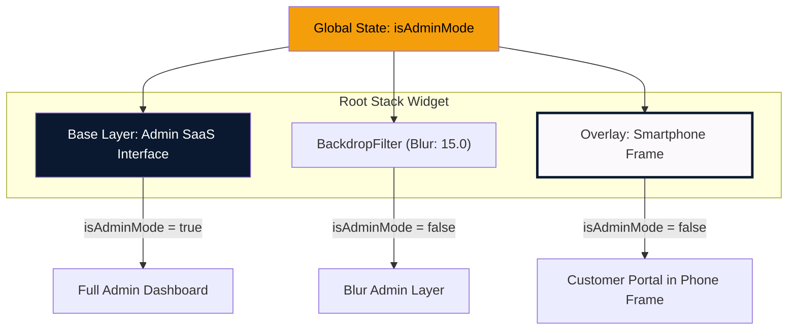
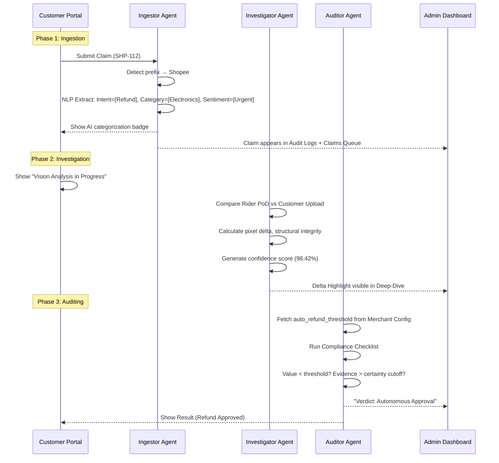
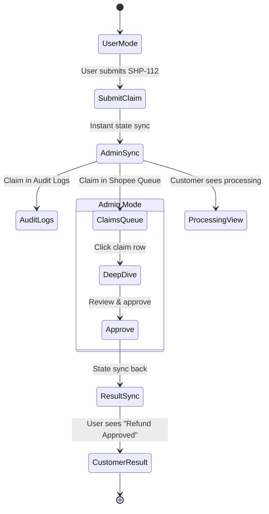

# VeriServe — Dual-Persona Logistics Audit SaaS (Flutter/Web)

## System Objective

Build a Flutter/Web application that serves as a **dual-persona gateway** for a logistics audit SaaS. The app demonstrates a high-fidelity B2B2C flow where customer claims are autonomously audited by a **3-agent reasoning pipeline (Ilmu-GLM-5.1)**.

---

## Stitch Assets Downloaded

All 9 screens have been downloaded to `frontend/stitch_assets/`:

### Screenshots (Visual Reference)

````carousel

<!-- slide -->

<!-- slide -->

<!-- slide -->

<!-- slide -->

<!-- slide -->

<!-- slide -->

<!-- slide -->

<!-- slide -->

````

### HTML Code (Implementation Baseline)

| # | Screen | File | Type | Dimensions |
|---|--------|------|------|------------|
| 1 | Global Dashboard (Tier 1) | [01_global_dashboard.html](file:///c:/Users/jonat/UMH/frontend/stitch_assets/html/01_global_dashboard.html) | Desktop | 2560×2048 |
| 2 | Merchants Management | [02_merchants_management.html](file:///c:/Users/jonat/UMH/frontend/stitch_assets/html/02_merchants_management.html) | Desktop | 2560×2048 |
| 3 | System Audit Logs | [03_system_audit_logs.html](file:///c:/Users/jonat/UMH/frontend/stitch_assets/html/03_system_audit_logs.html) | Desktop | 2560×2048 |
| 4 | Merchant Policy Editor | [04_merchant_policy_editor.html](file:///c:/Users/jonat/UMH/frontend/stitch_assets/html/04_merchant_policy_editor.html) | Desktop | 2560×2048 |
| 5 | Shopee Claims Queue (Tier 2) | [05_shopee_claims_queue.html](file:///c:/Users/jonat/UMH/frontend/stitch_assets/html/05_shopee_claims_queue.html) | Desktop | 2560×2048 |
| 7 | Customer Input Data | [07_customer_input.html](file:///c:/Users/jonat/UMH/frontend/stitch_assets/html/07_customer_input.html) | Desktop w/ Phone | 2560×2048 |
| 8 | Customer Processing | [08_customer_processing.html](file:///c:/Users/jonat/UMH/frontend/stitch_assets/html/08_customer_processing.html) | Desktop w/ Phone | 2560×2048 |
| 9 | Customer Result | [09_customer_result.html](file:///c:/Users/jonat/UMH/frontend/stitch_assets/html/09_customer_result.html) | Desktop w/ Phone | 2560×2048 |
| 10 | Audit Final Verdict (Tier 3) | [10_audit_final_verdict.html](file:///c:/Users/jonat/UMH/frontend/stitch_assets/html/10_audit_final_verdict.html) | Desktop | 2560×3048 |

---

## Design System: VeriServe Aesthetic

Extracted directly from the Stitch project's `designTheme`:

```yaml
Brand: Corporate / Modern — High-Contrast Functionalism
Font: Inter (exclusive)
Primary: Deep Navy (#0A192F)
Secondary: Slate Gray (#708090 / #94A3B8)
Tertiary: Light Gray (#E2E8F0)
Success: #10B981
Alert: #F59E0B
Error: #BA1A1A
Background: #FBF9FB
Surface: #FFFFFF
Roundness: ROUND_FOUR (4px default, 8px cards)
```

### Typography Scale

| Token | Size | Weight | Line-Height | Tracking |
|-------|------|--------|-------------|----------|
| `display-xl` | 36px | 700 | 44px | -0.02em |
| `headline-lg` | 24px | 600 | 32px | -0.01em |
| `headline-md` | 20px | 600 | 28px | — |
| `body-base` | 16px | 400 | 24px | — |
| `body-sm` | 14px | 400 | 20px | — |
| `label-caps` | 12px | 600 | 16px | 0.05em |
| `mono-log` | 13px | 500 | 18px | -0.01em |

---

## Architecture: The "Window-on-Top" Overlay



> [!IMPORTANT]
> The core architectural pattern is a `Stack` controlled by a `global isAdminMode boolean`:
> - **Admin Mode ON** → Full-screen desktop SaaS with 4-tab sidebar
> - **Admin Mode OFF** → Admin layer blurred (`BackdropFilter`, sigma: 15.0), centered high-fidelity phone frame hosting the Customer Portal

---

## Proposed Changes

### Component 1: Design Tokens & Theme

#### [MODIFY] [pubspec.yaml](file:///c:/Users/jonat/UMH/frontend/pubspec.yaml)
- Add `google_fonts: ^6.1.0` for Inter font
- Add `flutter_animate: ^4.5.0` for micro-animations
- Add `cached_network_image: ^3.4.0` for evidence images

#### [NEW] lib/theme/veriserve_theme.dart
- Complete Material 3 `ThemeData` matching the Stitch design system
- All color tokens from the extracted palette
- Typography scale matching the 7 text styles
- Shape theme with 4px/8px border radii

#### [NEW] lib/theme/veriserve_colors.dart
- Named color constants: `deepNavy`, `slateGray`, `successGreen`, `alertOrange`, etc.
- Material `ColorScheme` construction from the Stitch tokens

---

### Component 2: Global State Management

#### [MODIFY] [main.dart](file:///c:/Users/jonat/UMH/frontend/lib/main.dart)
- Wrap app with `ChangeNotifierProvider<AppState>`
- Replace the existing `HomeScreen` with the new `ShellScreen`
- Apply `VeriServeTheme` to `MaterialApp`

#### [NEW] lib/state/app_state.dart
```dart
class AppState extends ChangeNotifier {
  bool _isAdminMode = true;
  String? _activeClaimId;
  int _adminTabIndex = 0;     // 0=Overview, 1=Investigations, 2=Merchants, 3=AuditLogs
  int _customerStep = 0;       // 0=Input, 1=Processing, 2=Result
  List<Claim> _claims = [];    // Mock data store
  Map<String, MerchantPolicy> _policies = {};

  // Toggles + getters + notifiers
  void toggleMode() { ... }
  void submitClaim(Claim c) { ... }  // Adds to _claims, syncs to admin views
  void approveClaim(String id) { ... }
}
```

#### [NEW] lib/models/claim.dart
- `Claim` model: `id`, `orderId`, `merchant`, `category`, `description`, `evidenceUrls`, `status`, `confidence`, `riskLevel`, `agentTrace`

#### [NEW] lib/models/merchant_policy.dart
- `MerchantPolicy` model: `merchantId`, `name`, `autoRefundThreshold`, `certaintyCutoff`, `maxAutoAmount`, `categories`

---

### Component 3: Shell & Navigation

#### [NEW] lib/screens/shell_screen.dart
The root `Stack` widget implementing the dual-persona architecture:

```dart
Widget build(context) {
  return Stack(children: [
    // Layer 1: Admin SaaS (always rendered)
    AdminShell(tabIndex: state.adminTabIndex),

    // Layer 2: Blur overlay (when user mode)
    if (!state.isAdminMode)
      BackdropFilter(
        filter: ImageFilter.blur(sigmaX: 15, sigmaY: 15),
        child: Container(color: Colors.black.withOpacity(0.3)),
      ),

    // Layer 3: Phone frame (when user mode)
    if (!state.isAdminMode)
      Center(child: SmartphoneFrame(child: CustomerPortal())),

    // FAB: Mode toggle (always visible)
    Positioned(bottom: 32, right: 32, child: ModeToggleFAB()),
  ]);
}
```

#### [NEW] lib/widgets/smartphone_frame.dart
- High-fidelity iPhone-style frame: rounded corners (40px), notch, home indicator
- Fixed size: `390×844` (matching Stitch screens)
- Inner shadow + border treatment from the CSS: `box-shadow: 0 25px 50px -12px rgba(0,0,0,0.5), inset 0 0 0 4px #e4e2e4, inset 0 0 0 8px #fbf9fb`

---

### Component 4: Admin Mode Screens (Base Layer)

#### [NEW] lib/screens/admin/admin_shell.dart
- Persistent sidebar with 4 items: Overview, Investigations, Merchant Config, Audit Logs
- Top app bar with search, notifications, profile
- `IndexedStack` for tab content to preserve state

#### [NEW] lib/screens/admin/global_dashboard_screen.dart
**Maps to Screen 1 (Tier 1)**
- 3-column KPI row: Total Verified (1,240), Fraud Prevented (RM 15,200), Auto-Resolution Rate (92%)
- Live Investigations table: Shopee/GrabFood/Zalora rows with risk badges
- Data-driven from `AppState.claims`

#### [NEW] lib/screens/admin/claims_queue_screen.dart
**Maps to Screen 5 (Tier 2)**
- Shopee Claims Queue with filterable table
- Claim rows link to Deep-Dive Audit (Tier 3)
- Real-time badge showing new claims from customer submissions

#### [NEW] lib/screens/admin/audit_deep_dive_screen.dart
**Maps to Screen 10 (Tier 3)**
- Split layout: Left (7/12) for evidence, Right (5/12) for reasoning trace
- **Ingestor Analysis Widget**: Original complaint vs. NLP extractions (Intent, Damage Type, Sentiment)
- **Visual Evidence**: Side-by-side Rider PoD vs Customer Upload with "Delta Highlight" bounding box
- **Reasoning Trace Terminal**: Dark code-block style with line-numbered Ilmu-GLM-5.1 output
- **Auditor Verdict Widget**: Compliance checklist + "Verdict: Autonomous Approval" box
- Action buttons: "Flag for Review" / "Approve Claim"

#### [NEW] lib/screens/admin/merchants_screen.dart
**Maps to Screen 2**
- Merchant list with status, region, active claims
- Click through to Policy Editor

#### [NEW] lib/screens/admin/merchant_policy_screen.dart
**Maps to Screen 4**
- Form fields: `auto_refund_threshold`, `certainty_cutoff`, `max_auto_amount`
- Category matrix configuration
- Save/publish policy actions

#### [NEW] lib/screens/admin/audit_logs_screen.dart
**Maps to Screen 3**
- Chronological system audit log table
- Filterable by merchant, status, date range
- Real-time updates when claims are submitted/resolved

---

### Component 5: Customer Mode Screens (Overlay Layer)

#### [NEW] lib/screens/customer/customer_portal.dart
- Root widget for phone-frame content
- Routes between 3 steps based on `AppState.customerStep`

#### [NEW] lib/screens/customer/claim_input_screen.dart
**Maps to Screen 7 — Phase 1: Ingestion**
- Order ID input with prefix detection (SHP/GF/ZAL → merchant icon)
- Issue description textarea
- AI feedback badge: "VeriServe AI categorizing as: Electronics / Physical Damage"
- Evidence upload grid (3-column)
- "Submit Claim for Verification" button
- Recent Resolutions list

#### [NEW] lib/screens/customer/processing_screen.dart
**Maps to Screen 8 — Phase 2: Investigation**
- "Vision Analysis in Progress" animation
- Agent pipeline visualization:
  1. Ingestor Agent → Extracting entities
  2. Investigator Agent → Comparing evidence
  3. Auditor Agent → Checking policies
- Animated progress steps with checkmarks

#### [NEW] lib/screens/customer/result_screen.dart
**Maps to Screen 9 — Phase 3: Resolution**
- Final verdict card (Approved/Denied/Escalated)
- Confidence gauge
- Verification trace link
- "View Full Audit Trail" button

---

### Component 6: Services Layer

#### [MODIFY] [api_service.dart](file:///c:/Users/jonat/UMH/frontend/lib/services/api_service.dart)
- Refactor to abstract `ApiService` class with concrete `MockApiService` and `LiveApiService`
- `MockApiService`: Returns predefined data matching the Stitch screen content
- `LiveApiService`: Makes real `POST /api/orchestrate` calls to FastAPI backend

```dart
abstract class ApiService {
  Future<ClaimResult> submitClaim(Claim claim);
  Future<List<Claim>> getClaims({String? merchantFilter});
  Future<MerchantPolicy> getMerchantPolicy(String merchantId);
  Future<AuditTrace> getAuditTrace(String claimId);
}
```

#### [NEW] lib/services/mock_api_service.dart
- Pre-populated mock data matching all Stitch screen content
- Simulated delays for realistic UX
- 3-agent trace data for the reasoning terminal

---

### Component 7: Shared Widgets

#### [NEW] lib/widgets/sidebar_nav.dart
- 4-item navigation: Overview (radar), Investigations (policy), Merchants (hub), Audit Logs (receipt_long)
- Active state: bold text + right border + background fill
- Bottom section: Support, Settings

#### [NEW] lib/widgets/kpi_card.dart
- Reusable KPI card: label, icon, value, trend indicator, optional gauge bar

#### [NEW] lib/widgets/status_badge.dart
- AI-Verified (green), Pending Review (gray), Fraud Alert (red), Resolved (blue)

#### [NEW] lib/widgets/confidence_gauge.dart
- Linear gauge with percentage + animated fill

#### [NEW] lib/widgets/reasoning_trace.dart
- Terminal-style widget with line numbers, dark background (#0d1c32)
- Highlighted critical lines (red border-left)
- Animated cursor at bottom

#### [NEW] lib/widgets/mode_toggle_fab.dart
- Floating action button for Admin ↔ User toggle
- Icon: `admin_panel_settings` / `person`
- Label: "Switch to God Mode" / "Switch to User Mode"

---

## The 3-Step Agentic Flow (Complete)



---

## The Integrated State Loop



> [!IMPORTANT]
> **Real-time sync requirement**: When a claim is submitted in User Mode, it must instantly appear in both the "Audit Logs" (Screen 3) and "Shopee Claims Queue" (Screen 5) in the blurred background. Toggling to Admin Mode reveals these updates. Approving in Admin Mode triggers the "Result" (Screen 9) in User Mode.

---

## File Tree (Proposed)

```
lib/
├── main.dart                           [MODIFY]
├── theme/
│   ├── veriserve_theme.dart            [NEW]
│   └── veriserve_colors.dart           [NEW]
├── state/
│   └── app_state.dart                  [NEW]
├── models/
│   ├── claim.dart                      [NEW]
│   └── merchant_policy.dart            [NEW]
├── screens/
│   ├── shell_screen.dart               [NEW]
│   ├── admin/
│   │   ├── admin_shell.dart            [NEW]
│   │   ├── global_dashboard_screen.dart [NEW]
│   │   ├── claims_queue_screen.dart    [NEW]
│   │   ├── audit_deep_dive_screen.dart [NEW]
│   │   ├── merchants_screen.dart       [NEW]
│   │   ├── merchant_policy_screen.dart [NEW]
│   │   └── audit_logs_screen.dart      [NEW]
│   └── customer/
│       ├── customer_portal.dart         [NEW]
│       ├── claim_input_screen.dart      [NEW]
│       ├── processing_screen.dart       [NEW]
│       └── result_screen.dart           [NEW]
├── services/
│   ├── api_service.dart                [MODIFY]
│   └── mock_api_service.dart           [NEW]
└── widgets/
    ├── sidebar_nav.dart                [NEW]
    ├── smartphone_frame.dart           [NEW]
    ├── kpi_card.dart                   [NEW]
    ├── status_badge.dart               [NEW]
    ├── confidence_gauge.dart           [NEW]
    ├── reasoning_trace.dart            [NEW]
    └── mode_toggle_fab.dart            [NEW]
```

---

## Verification Plan

### Automated Tests
1. `flutter analyze` — Zero lint errors
2. `flutter test` — Unit tests for `AppState` (mode toggle, claim lifecycle, sync)
3. `flutter build web` — Successful web compilation

### Browser Verification
1. Launch with `flutter run -d chrome`
2. Verify Admin Mode: All 4 sidebar tabs render correctly
3. Toggle to User Mode: Verify blur + phone frame overlay
4. Submit a claim in User Mode → Verify it appears in Admin Audit Logs
5. Approve claim in Admin Mode → Verify result updates in User Mode

### Manual Verification
- Compare each screen against the downloaded Stitch screenshots
- Verify color tokens match the design system
- Test responsive behavior at different viewport sizes

---

## Open Questions

> [!IMPORTANT]
> **Q1**: Should the app target **Flutter Web only**, or do you also need the native Android/iOS builds to work with this implementation? The phone frame overlay is a *simulated* mobile experience within a desktop web view. If you need actual mobile builds, the Customer Portal would be the native screen without the frame.

> [!IMPORTANT]
> **Q2**: For the `LiveApiService`, what is the FastAPI backend base URL? Should I stub it as `http://localhost:8000` for now, or is there a deployed endpoint?

> [!NOTE]
> **Q3**: The existing `complaint_screen.dart` and `trace_dashboard_screen.dart` will be superseded by the new screen architecture. Should they be deleted or preserved as legacy references?
