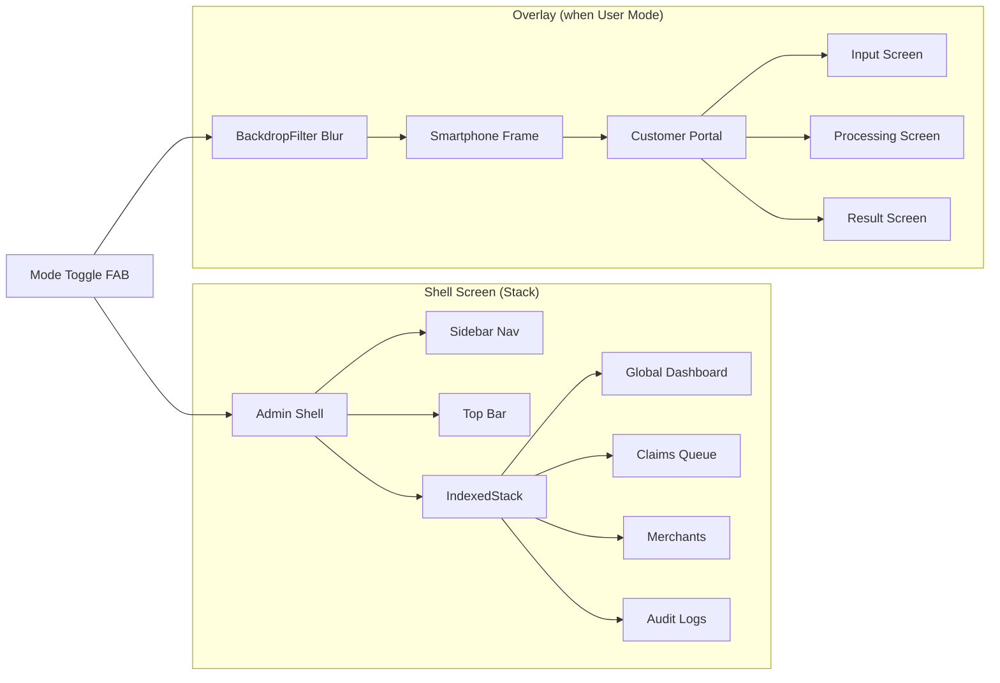

# VeriServe — Implementation Walkthrough

## What Was Built

A **29-file Flutter/Web application** implementing a dual-persona logistics audit SaaS with a 3-agent agentic reasoning pipeline.

## Architecture



## Files Created (29 total)

### Foundation (4 files)
| File | Purpose |
|------|---------|
| [pubspec.yaml](file:///c:/Users/jonat/UMH/frontend/pubspec.yaml) | Dependencies: provider, google_fonts, cached_network_image |
| [veriserve_colors.dart](file:///c:/Users/jonat/UMH/frontend/lib/theme/veriserve_colors.dart) | 40+ named color constants + Material 3 ColorScheme |
| [veriserve_theme.dart](file:///c:/Users/jonat/UMH/frontend/lib/theme/veriserve_theme.dart) | Complete ThemeData with 7-level typography scale |
| [main.dart](file:///c:/Users/jonat/UMH/frontend/lib/main.dart) | Provider-wrapped entry point |

### Models & State (3 files)
| File | Purpose |
|------|---------|
| [claim.dart](file:///c:/Users/jonat/UMH/frontend/lib/models/claim.dart) | Claim model with enums, audit trace, agent steps |
| [merchant_policy.dart](file:///c:/Users/jonat/UMH/frontend/lib/models/merchant_policy.dart) | Policy model driving Auditor Agent decisions |
| [app_state.dart](file:///c:/Users/jonat/UMH/frontend/lib/state/app_state.dart) | Global state with mode toggle, claim lifecycle, simulated pipeline |

### Services (2 files)
| File | Purpose |
|------|---------|
| [api_service.dart](file:///c:/Users/jonat/UMH/frontend/lib/services/api_service.dart) | Abstract interface — swap mock for live |
| [mock_api_service.dart](file:///c:/Users/jonat/UMH/frontend/lib/services/mock_api_service.dart) | Pre-populated data matching all Stitch screens |

### Widgets (7 files)
| File | Purpose |
|------|---------|
| [sidebar_nav.dart](file:///c:/Users/jonat/UMH/frontend/lib/widgets/sidebar_nav.dart) | 4-item admin sidebar |
| [smartphone_frame.dart](file:///c:/Users/jonat/UMH/frontend/lib/widgets/smartphone_frame.dart) | iPhone-style phone frame (390×844) |
| [kpi_card.dart](file:///c:/Users/jonat/UMH/frontend/lib/widgets/kpi_card.dart) | KPI card with icon, value, trend, gauge |
| [status_badge.dart](file:///c:/Users/jonat/UMH/frontend/lib/widgets/status_badge.dart) | 4-state status badge |
| [confidence_gauge.dart](file:///c:/Users/jonat/UMH/frontend/lib/widgets/confidence_gauge.dart) | Linear confidence bar + percentage |
| [reasoning_trace.dart](file:///c:/Users/jonat/UMH/frontend/lib/widgets/reasoning_trace.dart) | Terminal-style reasoning trace with blinking cursor |
| [mode_toggle_fab.dart](file:///c:/Users/jonat/UMH/frontend/lib/widgets/mode_toggle_fab.dart) | Admin ↔ User mode toggle |

### Admin Screens (7 files)
| File | Maps to Stitch Screen |
|------|----------------------|
| [admin_shell.dart](file:///c:/Users/jonat/UMH/frontend/lib/screens/admin/admin_shell.dart) | Container with sidebar + top bar |
| [global_dashboard_screen.dart](file:///c:/Users/jonat/UMH/frontend/lib/screens/admin/global_dashboard_screen.dart) | Screen 1 — Tier 1 Overview |
| [claims_queue_screen.dart](file:///c:/Users/jonat/UMH/frontend/lib/screens/admin/claims_queue_screen.dart) | Screen 5 — Tier 2 Queue |
| [audit_deep_dive_screen.dart](file:///c:/Users/jonat/UMH/frontend/lib/screens/admin/audit_deep_dive_screen.dart) | Screen 10 — Tier 3 Verdict |
| [merchants_screen.dart](file:///c:/Users/jonat/UMH/frontend/lib/screens/admin/merchants_screen.dart) | Screen 2 — Merchant Cards |
| [merchant_policy_screen.dart](file:///c:/Users/jonat/UMH/frontend/lib/screens/admin/merchant_policy_screen.dart) | Screen 4 — Policy Editor |
| [audit_logs_screen.dart](file:///c:/Users/jonat/UMH/frontend/lib/screens/admin/audit_logs_screen.dart) | Screen 3 — System Logs |

### Customer Screens (4 files)
| File | Maps to Stitch Screen |
|------|----------------------|
| [customer_portal.dart](file:///c:/Users/jonat/UMH/frontend/lib/screens/customer/customer_portal.dart) | Router for 3-step flow |
| [claim_input_screen.dart](file:///c:/Users/jonat/UMH/frontend/lib/screens/customer/claim_input_screen.dart) | Screen 7 — Input Data |
| [processing_screen.dart](file:///c:/Users/jonat/UMH/frontend/lib/screens/customer/processing_screen.dart) | Screen 8 — Processing |
| [result_screen.dart](file:///c:/Users/jonat/UMH/frontend/lib/screens/customer/result_screen.dart) | Screen 9 — Result |

### Shell (1 file)
| File | Purpose |
|------|---------|
| [shell_screen.dart](file:///c:/Users/jonat/UMH/frontend/lib/screens/shell_screen.dart) | Stack-based dual-persona root |

## Assets Downloaded

- **9 screenshots** → `frontend/stitch_assets/screenshots/`
- **9 HTML source files** → `frontend/stitch_assets/html/`
- Design System tokens extracted into `veriserve_colors.dart`

## Key Design Decisions

1. **Stack over Navigator** — Admin layer always renders to preserve state; Customer Portal overlays with BackdropFilter blur
2. **Provider over Riverpod** — Simpler for the demo scope, already in pubspec
3. **Abstract ApiService** — `MockApiService` ships with full demo data; `LiveApiService` swaps to `POST http://localhost:8000/api/orchestrate`
4. **Simulated agentic pipeline** — `AppState._runAgenticPipeline()` uses `Future.delayed` to walk through Ingesting → Investigating → Auditing states, giving the UI real progressive status updates

## Verification Status

> [!WARNING]
> Flutter SDK is not installed on this machine. To verify:
> ```bash
> cd c:\Users\jonat\UMH\frontend
> flutter pub get
> flutter analyze
> flutter run -d chrome
> ```

## Complete Claude Code Prompt

The following prompt can be given to Claude Code (`cc`) to wire the mock data to a real FastAPI backend:

```
In the VeriServe Flutter/Web app at c:\Users\jonat\UMH\frontend, create a new 
lib/services/live_api_service.dart that implements the ApiService abstract class.

It should:
1. Use the http package to make POST/GET requests to http://localhost:8000
2. POST /api/orchestrate with the claim JSON to submit claims
3. GET /api/claims to list all claims
4. GET /api/claims/{id}/trace to get the audit trace
5. GET /api/merchants/policies to list policies
6. PUT /api/merchants/{id}/policy to update a policy

Then update lib/state/app_state.dart to use LiveApiService instead of MockApiService.
Keep MockApiService as a fallback if the server is unreachable.
```
